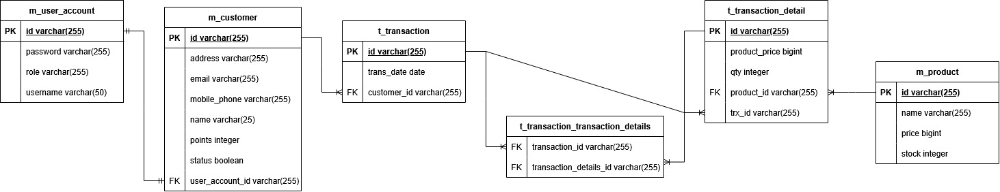

# Maju Mundur Shop API
Maju Mundur is clothing market place to connect multiple merchant and customer. To be able maintain retention customer, Maju Mundur preparing reward point to customer which succeed transaction. Reward point can be trade with reward which already prepared by Maju Mundur. There is two reward, Reward A worth 20 point and Reward B worth 40 point.

This program were made using Spring Boot (Java-based REST API).

Before turning on the API, make sure to turn on the ```redis-server``` first in Linux / WSL.

## Entity

- m_customer
```java
class Customer {
    private String id; // Generation Type menggunakan UUID
    private String name;
    private String mobilePhone;
    private String email;
    private String address;
    private Boolean status;
    private Integer points; // reward points yang diterima customer
    private UserAccount userAccount;
}
```

- m_product
```java
public class Product {
    private String id;
    private String name;
    private Long price;
    private Integer stock;
}
```

- m_user_account
```java
    private String id;
    private String username;
    private String password;
    private UserRole role;
    private Customer customer; // bila bukan customer, null
```

- t_transaction
```java
public class Transaction {
    private String id;
    private Customer customer;
    private List<TransactionDetail> transactionDetails;
    private Date transDate;
}
```

- t_transaction_detail
```java
public class TransactionDetail {
    private String id;
    private Transaction transaction;
    private Product product;
    private Long productPrice;
    private Integer qty;
}
```

Produced database scheme


## API Documentation

### Auth

#### Register as Merchant (must through ROLE_MERCHANT)

Request :
- Endpoint : /api/auth/register/admin
- Method : POST

Body :
```json
{
    "username" : "string",
    "password" : "string"
}
```

Response :
```json
{
    "statusCode": 200,
    "message": "SUCCESS REGISTER MERCHANT",
    "data": {
        "id": "string-uuid",
        "username": "string",
        "role": "Merchant"
    },
    "paging": null
}
```

#### Login

Request :
- Endpoint : /api/auth/login
- Method : POST

Body :
```json
{
    "username" : "string",
    "password" : "string"
}
```

Response (if Merchant):
```json
{
    "statusCode": 200,
    "message": "Login Successful",
    "data": {
        "accessToken": "token-code-using-SHA-256",
        "role": "[ROLE_MERCHANT]"
    },
    "paging": null
}
```

Response (if User / Customer):
```json
{
    "statusCode": 200,
    "message": "Login Successful",
    "data": {
        "accessToken": "token-code-using-SHA-256",
        "role": "[ROLE_USER]"
    },
    "paging": null
}
```

#### Register as Customer / User
Request :

- Endpoint : /api/v1/customer
- Method : POST

Form Data:
```
- name: string-input
- address: string-input
- email: string-input
- mobilePhone: string-input
- userName: string-input
- password: string-input
```

Response:
```json
{
    "id": "string",
    "name": "string",
    "email": "string",
    "phoneNumber": "string",
    "username": "string",
    "role": "User"
}
```

### Customer
#### Get All Customer (must through ROLE_MERCHANT)
Request :
- Endpoint : /api/v1/customer
- Method : GET
- Params: ```name```, ```mobilePhone```, ```status```

#### Get Customer By ID (must through ROLE_MERCHANT)
Request :
- Endpoint : /api/v1/customer/{customerId}
- Method : GET

#### Update Customer (must through ROLE_MERCHANT)
Request :
- Endpoint : /api/v1/customer/{customerId}
- Method : PUT
Body:
```json
{
    "id": "string",
    "name": "string",
    "email": "string",
    "phoneNumber": "string",
    "username": "string",
    "role": "User"
}
```

#### Delete Customer (must through ROLE_MERCHANT)
Request :
- Endpoint : /api/v1/customer/{customerId}
- Method : DELETE

Response:
```Successfully delete customer```

### Product
#### Create Product (must through ROLE_MERCHANT)
Request :
- Endpoint : /api/v1/product
- Method : POST
Body :
```json
{
    "name": "product-name",
    "price": "product-price-in-integer",
    "stock": "product-stock-in-integer"
}
```
#### Get All Product 
Request :
- Endpoint : /api/v1/product
- Method : GET

#### Get Product By ID
Request :
- Endpoint : /api/v1/product/{productId}
- Method : GET

#### Update Product (must through ROLE_MERCHANT)
Request :
- Endpoint : /api/v1/product/{product-id}
- Method : PUT
Body :
```json
{
    "name": "product-name",
    "price": "product-price-in-integer",
    "stock": "product-stock-in-integer"
}
```
#### Delete Product (must through ROLE_MERCHANT)
Request :
- Endpoint : /api/v1/product/{productId}
- Method : DELETE

Response:
```"Successfully delete product"```

### Transaction
#### Create Transaction
Request :
- Endpoint : /api/v1/product/{product-id}
- Method : PUT
Body :
```json
{
    "customerId": "string",
    "transactionDetail": [
        {
            "productId": "string",
            "qty": integer
        },
        {
            "productId": "string",
            "qty": integer
        },
        {
            "productId": "string",
            "qty": integer
        }
    ]
}
```
